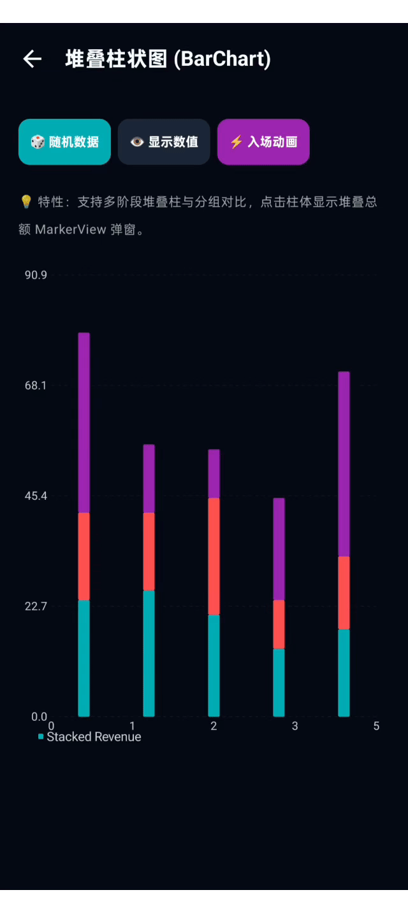
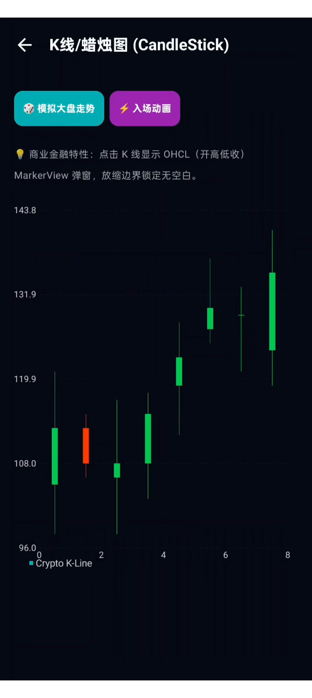
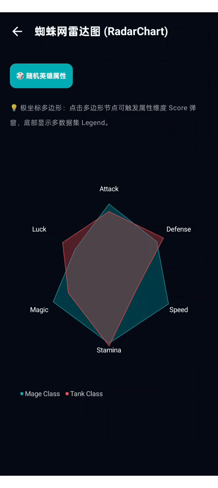

# 📊 ComposeCharts (MPAndroidChart Feature-Parity Library in Jetpack Compose)


`ComposeCharts` is a high-performance, declarative, and cross-platform chart library built with **Jetpack Compose Multiplatform**. It re-imagines the feature set of the classic `MPAndroidChart` with modern Compose declarative APIs, GPU-accelerated Skia rendering, and reactive state management.

---

## 🎨 Supported Chart Types

### 1. LineChart (多折线平滑走势图)

*   **Features**: Cubic Bezier smoothing (`isCubic`), vertical gradient area fills (`fillBrush`), data point circle indicators, crosshair touch highlighting, and centroid-focused pinch-to-zoom.

### 2. BarChart (多维/堆叠柱状图)

*   **Features**: Single bars, grouped comparison bars, multi-segment stacked bars (`yValues: FloatArray`), rounded bar corners, value text labels, and MarkerView tooltip popups.

### 3. PieChart (环形/饼图)

*   **Features**: Solid pie and Donut hole rendering (`holeRadiusRatio`), seamless zero-gap slice drawing, touch slice selection with `selectionShift` offset animations, and calibrated 12 o'clock top angle alignment.

### 4. CandleStickChart (K线/蜡烛图)

*   **Features**: Financial-grade Open-High-Low-Close (OHLC) candles, high/low shadow lines, customizable increasing/decreasing colors, and smooth high-volume scrolling with strict viewport clipping.

### 5. RadarChart (蜘蛛网雷达图)

*   **Features**: Polar coordinate polygon web lines, multi-dataset polygon overlays with alpha blending, and attribute score MarkerView tooltips.

---

## ⚡ Core Architecture & Engineering

1.  **Strict Viewport Boundary Constraints (`ViewportHandler.kt`)**:
    *   Enforces viewport boundaries (`constrainTranslation()`) so that zooming and drag-panning operations never allow chart contents to fly off-screen or leave empty whitespace.
2.  **MarkerView & Tooltip System (`MarkerView.kt`)**:
    *   Interactive floating card popups positioned above tapped data points with edge-avoidance logic.
3.  **Dynamic Legend System (`Legend.kt`)**:
    *   Draws dataset color keys and labels automatically below the chart.
4.  **Cross-Platform Navigation (`BackHandler`)**:
    *   Supports native system back gestures (Android `BackHandler`) and edge swipe-to-back gestures.

---

## 📖 Usage

### Simple LineChart Example

```kotlin
val entries = listOf(
    Entry(0f, 10f),
    Entry(1f, 80f),
    Entry(2f, 45f),
    Entry(3f, 100f)
)

val dataSet = LineDataSet("My Data", entries).apply {
    color = Color(0xFF00ADB5)
    drawFilled = true
    isCubic = true // Smooth Bezier curve
}

LineChart(
    dataSets = listOf(dataSet),
    modifier = Modifier.fillMaxWidth().height(300.dp)
)
```

---

## 🚀 Getting Started

### 1. Enter Project Directory
```bash
cd "ComposeCharts"
```

### 2. Run Android App
```bash
./gradlew :composeApp:installDebug
```

### 3. Compile iOS Target
```bash
./gradlew :composeApp:compileKotlinIosSimulatorArm64
```

---

## 📂 Workspace Structure

```
ComposeCharts/
├── composeApp/                     # Shared module & target integrations
│   ├── src/
│   │   ├── commonMain/kotlin/      # Shared components & charts
│   │   │   └── com/charts/compose/
│   │   │       ├── App.kt          # Navigation coordinator
│   │   │       ├── core/           # ViewportHandler, Axis, Legend, MarkerView, Gestures
│   │   │       ├── data/           # Entry, BarEntry, PieEntry, CandleEntry, RadarEntry, DataSet
│   │   │       ├── charts/         # LineChart, BarChart, PieChart, CandleStickChart, RadarChart
│   │   │       └── screens/        # Demo showcase screens
│   │   ├── androidMain/            # Android entry & BackHandler
│   │   └── iosMain/                # iOS entry & BackHandler
│   └── build.gradle.kts            # Module build settings
├── settings.gradle.kts             # Settings config
├── .gitignore                      # Git ignore rules
└── build.gradle.kts                # Root build settings
```

---

## 📄 License

This project is licensed under the MIT License - see the [LICENSE](./LICENSE) file for details.

Copyright (c) 2026 Yangcy Zhang
